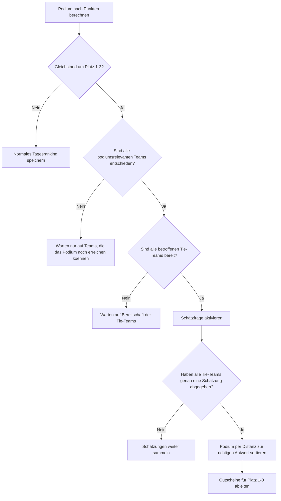

# Schätzfrage Flow

## Zusätzliche Regeln

- Zusatzzeit verlängert nur das Ende der Runde. Sie ändert keine Punkte und startet keine Schätzfrage von selbst.
- Teams, die selbst mit allen Restpunkten das Podium nicht mehr erreichen können, blockieren die Schätzfrage nicht.
- Die Schätzfrage ist nur für Teams relevant, die wirklich in einem Podiums-Gleichstand liegen.
- Für die Schätzfrage zählt pro Team genau die erste Abgabe.
- Ohne Podiums-Gleichstand wird direkt das normale Tagesranking verwendet.
